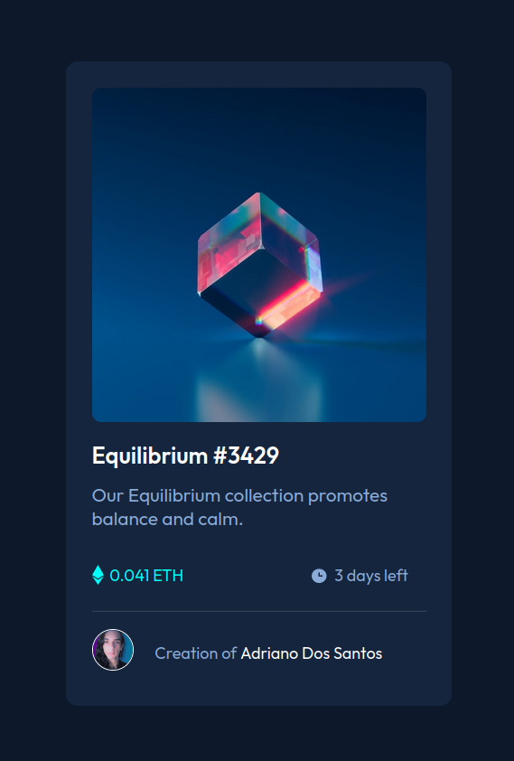
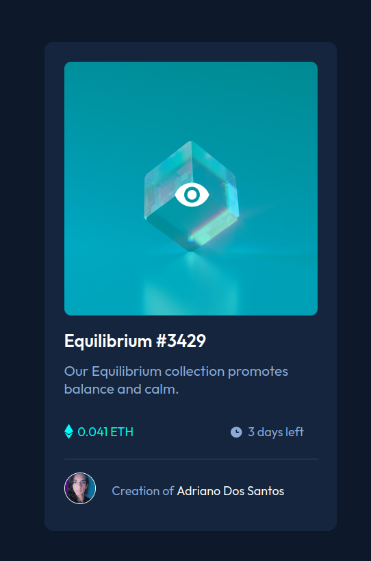

# Frontend Mentor - QR code component solution

This is a solution to the [NFT preview card component challenge on Frontend Mentor](https://www.frontendmentor.io/challenges/nft-preview-card-component-SbdUL_w0U). Frontend Mentor challenges help you improve your coding skills by building realistic projects.

## Overview

a nice and simple beginner card project

### Screenshot

### Built with

- Semantic HTML5 markup
- CSS custom properties
- Flexbox

